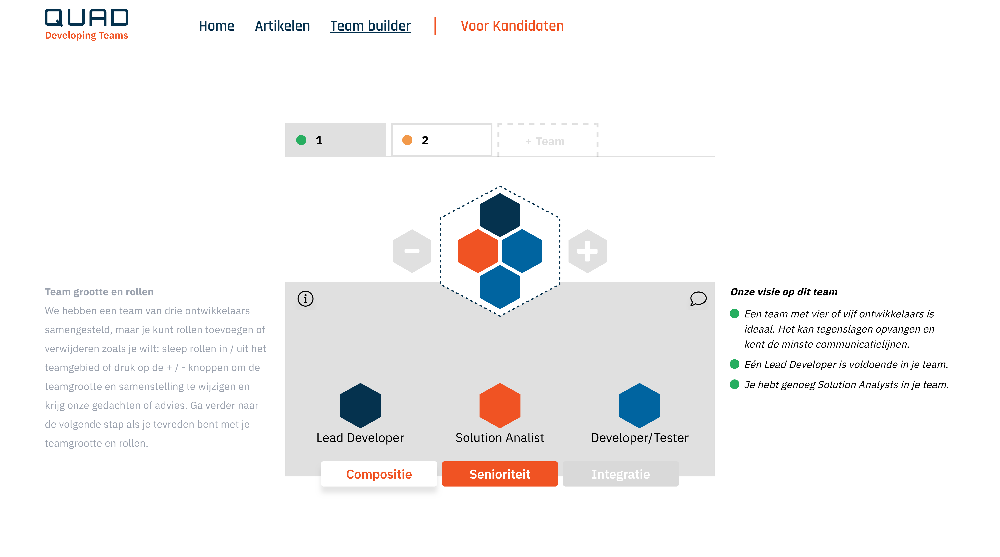

# Team Builder Application

*Project completed in Fall of 2024 to develop an interactive team composition advisory tool for the company Quad Solutions.*

The Team Builder is a web-based application designed to educate prospective customers on optimal software development team sizes and structures. It provides dynamic, data-driven advice on team composition tailored to project variables, helping align customer expectations with Quad Solutions' expertise.

## Overview

This application connects users with insights into effective team building by allowing them to compose teams of 3-13 members, configure roles and seniorities, and receive immediate feedback on their configurations. It integrates seamlessly with the Quad Solutions corporate website and offers scalable, responsive design optimized for varied devices.

## Key Features

- Interactive team composition interface with role and seniority assignment
- Dynamic textual advice reflecting team configuration strengths and risks
- Support for splitting larger teams into smaller teams
- Configurable external project factors influencing advice outcomes
- Secure contact request submission with user and team details
- Integration with Slack for team submission notifications
- Responsive UI following UX design with mobile and desktop support

## Architecture and Workflow

- **Frontend:** Next.js and React framework leveraging Tailwind CSS for UI styling
- **Backend:** Java API built with Quarkus, deployed on Heroku for cloud scalability
- **Messaging:** Slack integration for notifying team submission
- Continuous integration and deployment (CI/CD) configured via Jenkins and Heroku pipelines

## User Roles

| Role       | Description                                             |
|------------|---------------------------------------------------------|
| Prospective Users | Compose teams, receive advice, and request contact |
| Administrators    | Manage contact requests and monitor submissions    |

## Contact

For questions, or documentation requests, please reach out to the project owner.